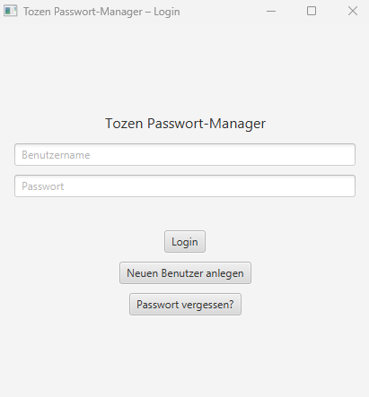
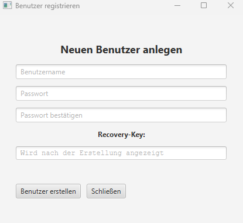
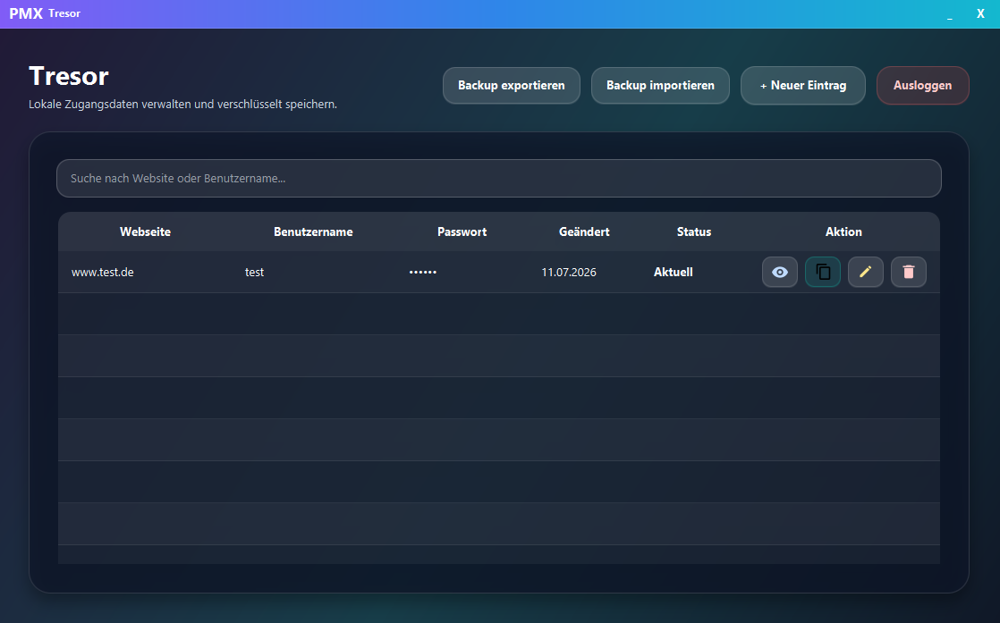

# TOZEN Password Manager

Ein lokaler Offline-Passwort-Manager, entwickelt mit **Java**, **JavaFX**, **SQLite** und **NitriteDB**.

## Überblick

Dieses Projekt wurde im Rahmen meiner Umschulung zum **Fachinformatiker für Anwendungsentwicklung** entwickelt.  
Ziel war die Umsetzung eines lokalen Passwort-Managers mit Fokus auf **Sicherheit**, **Offline-Betrieb** und **klarer Benutzerführung**.

## Funktionen

- Benutzerregistrierung und Login
- Lokale, verschlüsselte Speicherung von Zugangsdaten
- Passwortgenerator
- Recovery-Funktion
- Übersichtliche Tresoransicht für gespeicherte Einträge
- Offline-Nutzung ohne Cloud-Anbindung

## Technologien

- Java 17
- JavaFX
- Maven
- SQLite
- NitriteDB
- JUnit 5

## Sicherheitskonzept

- **AES-256-GCM** zur Verschlüsselung sensibler Daten
- **PBKDF2-HMAC-SHA-256** zur Schlüsselableitung
- Trennung von Benutzerverwaltung und Tresordaten
- Keine Speicherung produktiver Daten im Repository
- Keine Cloud-Dienste oder externe Synchronisierung

## Projektstruktur

```text
src/
├─ main/
│  ├─ java/
│  └─ resources/
└─ test/
   └─ java/
```
## Screenshots

### Login


### Registrierung


### Tresoransicht

